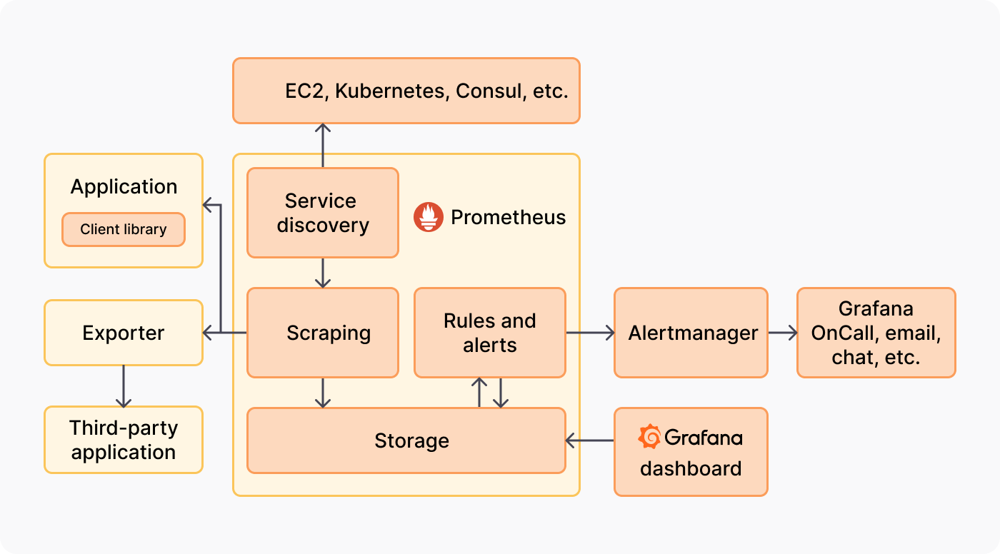

# Enterprise Monitoring Migration: Legacy Tools → Prometheus & Grafana

## Purpose
This project demonstrates migrating enterprise monitoring from legacy tools (Nagios, Zabbix, etc.) to a modern observability stack using **Prometheus** and **Grafana**, showcasing SRE skills including metrics collection, alerting, and dashboarding.

## Architecture

**Components:**
- **Prometheus**: Metrics collection & storage
- **Grafana**: Visualization dashboards
- **Custom Exporters**: Application-specific metrics
- **Alertmanager**: Alert routing and notification
- **Docker Compose**: Local deployment for testing

## Key Features
- Monitoring migration from legacy systems
- Custom Python exporters
- Predefined alerting rules
- Grafana dashboards with key metrics
- Dockerized environment for rapid deployment

## Setup Instructions
See [docs/setup_instructions.md](docs/setup_instructions.md)

